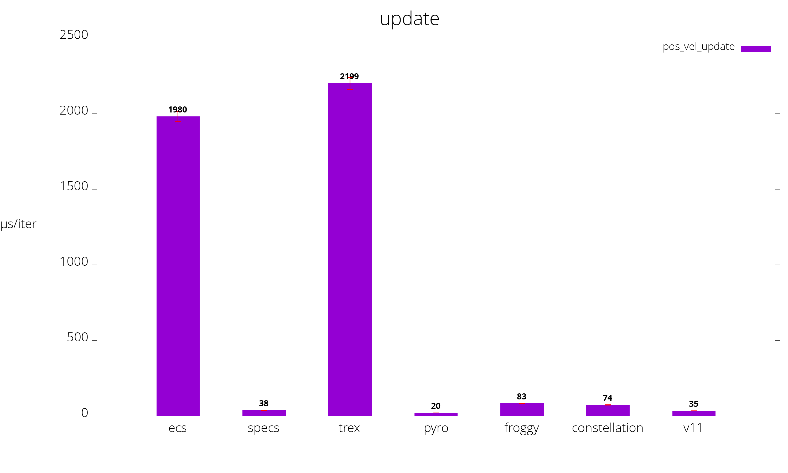
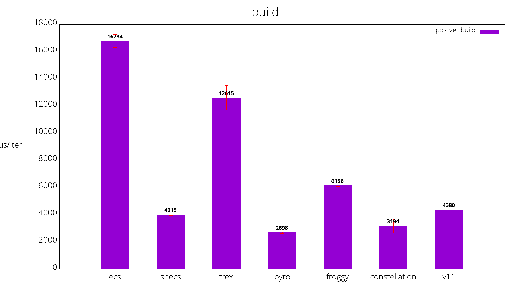

# Benchmarks of various Rust Entity Component Systems

## Benchmarks
Benchmarks are run on [Travis CI](https://travis-ci.org/lschmierer/ecs_bench/).

Benchmarks are located in `benches/[bench_name]_[ecs_crate_name].rs`.

 Library         | pos_vel build                 | pos_vel update                 | parallel build                 | parallel update
 --------------- |:-----------------------------:|:------------------------------:|:------------------------------:|:--------------------------------:
 [calx-ecs]      | {pos_vel_build_calx_ecs}      | {pos_vel_update_calx_ecs}      | {parallel_build_calx_ecs}      | {parallel_update_calx_ecs}
 [constellation] | 2,257 µs/iter (+/- 344) | 77 µs/iter (+/- 0) | {parallel_build_constellation} | {parallel_update_constellation}
 [ecs]           | 15,876 µs/iter (+/- 279)           | 2,211 µs/iter (+/- 13)           | {parallel_build_ecs}           | {parallel_update_ecs}
 [froggy]        | 5,376 µs/iter (+/- 117)        | 76 µs/iter (+/- 0)        | {parallel_build_froggy}        | {parallel_update_froggy}
 [specs]         | 3,359 µs/iter (+/- 191)         | 47 µs/iter (+/- 0)         | {parallel_build_specs}         | {parallel_update_specs}
 [trex]          | 11,674 µs/iter (+/- 641)          | 2,179 µs/iter (+/- 8)          | {parallel_build_trex}          | {parallel_update_trex}

[calx-ecs]: https://github.com/rsaarelm/calx-ecs
[constellation]: https://github.com/TomGillen/constellation/
[ecs]: https://github.com/HeroesGrave/ecs-rs
[froggy]: https://github.com/kvark/froggy
[specs]: https://github.com/slide-rs/specs
[trex]: https://github.com/rcolinray/trex

Visualization of benchmarks, smaller is better.

### pos_vel
 * 1000 entities with `position` and `velocity` components
 * 9000 entities with `position` components only
 * stub `render` system
 * `physics` system: `position += velocity`

### parallel
 * 10000 entities with 3 simple components `R`, `W1` and `W2`
 * `w1` system reads `R` and writes to `W1`
 * `w2` system reads `R` and writes to `W2`
 * systems could be run in parallel

## Notes
 * the benchmarks explore a limited subset of ECS use-cases and do not necessarily reflect the peformance of large-scale applications
 * [froggy](https://github.com/kvark/froggy) is technically not an ECS, but a Component Graph System (CGS)
